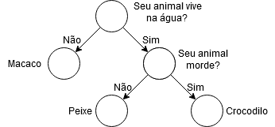

# Introdução

O desafio consistia em emular o comportamento do "Jogo dos Animais" enviado 
por email. O jogo consiste em um prompt responsivo onde o algoritmo tenta "prever"
o animal imaginado pelo jogador através de uma série de perguntas cujas respostas
são sim ou não.

Outra característica importante é que como nem todas as perguntas estão pré-mapeadas, 
o jogador tem a possibilidade de "criar perguntas" novas quando o algoritmo não acerta 
o animal imaginado.

# Executando

A partir na raiz do projeto, execute os seguintes comandos.

```
    pip install -r requirements.txt
    python src/main.py
```


# Exemplos de uso
Alguns exemplos de entrada e resposta esperados:
```
Pense em um animal, digite OK para continuar, ou exit a qualquer momento para sair
>> OK
O seu animal vive na água?
>> N
O seu animal é o Peixe?
>> N
Em qual animal você pensou?
>> Crocodilo
O que o/a [Crocodilo] faz que o/a [Peixe] não faz?
>> morde

Pense em um animal, digite OK para continuar, ou exit a qualquer momento para sair
>> OK
O seu animal vive na água?
>> N
O seu animal morde?
>> S
O seu animal é o [Crocodilo]?
>> S
Acertei!

Pense em um animal, digite OK para continuar, ou exit a qualquer momento para sair
>> exit
Obrigado por jogar!!!
```


Este caso ilustra a situação de criação de uma nova pergunta ao longo do jogo. 
Logo após a criação, o jogo se re-inicia e é possível testar a nova pergunta.
Os colchetes [] apenas indicam que os itens foram carregados dinamicamente.

Se o jogador desejar sair do jogo a qualquer momento ele pode escolher por inserir `exit`.

# Estrutura de Dados

A estrutura utilizada para guardar as informações do jogo é uma espécie de 
[Árvore Binária](https://en.wikipedia.org/wiki/Binary_tree) simplificada.

Um exemplo de árvore para o jogo do exemplo anterior se encontra abaixo:

